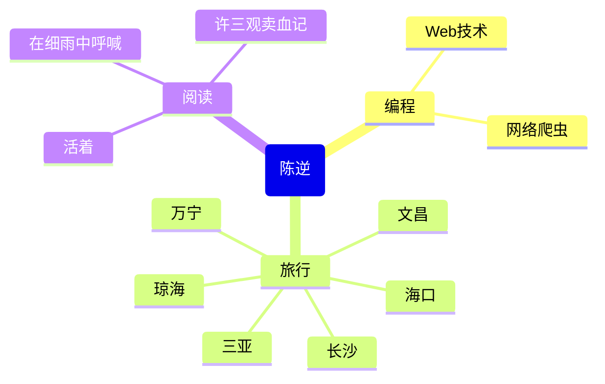

<div align="center">
    <!-- dynamic typing effect 动态打字效果 -->
    <div align="center">
    <a href="https://www.chenxiaoni.work/">
            
        </a>
    </div>
    <!-- 敲代码图片 -->
    <br>
    <!-- profile logo 个人资料徽标 -->
    <div align="center">
        <a href="https://www.chenxiaoni.work/"></a>&emsp;
        <a href="https://space.bilibili.com//"></a>&emsp;
        <a href="https://blog.csdn.net/weixin_50915462/"></a>&emsp;
        <a href="https://www.zhihu.com/people/sunguoqi/"></a>&emsp;
    <!-- vistor statistics logo访问量统计徽章 -->
    
    <!-- Snake Code Contribution Map 贪吃蛇代码贡献图 -->
    <picture>
      <source media="(prefers-color-scheme: dark)" srcset="https://cdn.jsdelivr.net/gh/qichenxiaoni/qichenxiaoni/profile-snake-contrib/github-contribution-grid-snake-dark.svg" />
      <source media="(prefers-color-scheme: light)" srcset="https://cdn.jsdelivr.net/gh/qichenxiaoni/qichenxiaoni/profile-snake-contrib/github-contribution-grid-snake.svg" />
      
    </picture>

</div>

#  🙋 Hello
<table>
<tr><td>

<!-- About me 关于我 -->
### About Me


<p>&emsp;&emsp;我，一个时常想摆烂的代码人</p>
<p>&emsp;&emsp;正在努力学习编程</p>
<p>&emsp;&emsp;学习编程很痛苦，但我享受执行成功那一瞬间的喜悦</p>
<p>&emsp;&emsp;我们终会遇见美好，真心祝愿你我得偿所愿</p>
<p>&emsp;&emsp;Cherish the present, cherish the people in front of you, life is only once, not so much in the future</p>
<p>&emsp;&emsp;别人的话构不成万分之一的我，却可以成为一览无余的他</p>

</td></tr>

<tr>
<td>

### Work Experience


- [湖南会风电力科技有限公司]()&emsp; 📌 2023-08-21 ——Now
  - 工作岗位：数据分析员
  - 工作内容：数据相关

</td>
</tr>

<tr><td>

### Recent Blog


<!-- START_SECTION:blog -->
* <a href="https://www.chenxiaoni.work/2023/04/20/Obsidian%E9%83%A8%E5%88%86%E6%8F%92%E4%BB%B6%E6%B1%89%E5%8C%96%E6%95%99%E7%A8%8B/" target='_blank'>Obsidian插件汉化</a> -2023-04-20
<!-- END_SECTION:blog -->

</td></tr>

<tr><td>

### Second Brain


<!-- START_SECTION:brain -->
* <a href='https://developer.mozilla.org/zh-CN/docs/Web/HTML' target="_blank">HTML</a>
* <a href='https://developer.mozilla.org/zh-CN/docs/Learn/CSS' target="_blank">CSS</a>
* <a href='https://developer.mozilla.org/zh-CN/docs/Web/JavaScript' target="_blank">JavaScript</a>
<!-- END_SECTION:brain -->

</td></tr>

<tr><td>

### Funny Soul


<!-- START_SECTION:douban -->
* <a href="https://book.douban.com/subject/4913064/" target="_blank">活着</a> 🌟🌟🌟🌟🌟 力荐
<!-- END_SECTION:douban -->

</td></tr>

<!-- wakatime统计 -->
<tr><td>

### Wakatime

<picture>
  <source
    srcset="https://github-readme-stats.vercel.app/api/wakatime?username=qichenxiaoni&layout=compact&text_color=f0f6fc&bg_color=00000000&hide_border=true&hide_title=true"
    media="(prefers-color-scheme: dark)"
  />
  <source
    srcset="https://github-readme-stats.vercel.app/api/wakatime?username=qichenxiaoni&layout=compact&text_color=1f2328&bg_color=00000000&hide_border=true&hide_title=true"
    media="(prefers-color-scheme: light), (prefers-color-scheme: no-preference)"
  />
  
</picture>
</td></tr>

<tr><td>

<!--START_SECTION:waka-->
**I'm an Early 🐤** 

```text
🌞 Morning                52 commits          █████░░░░░░░░░░░░░░░░░░░░   21.22 % 
🌆 Daytime                118 commits         ████████████░░░░░░░░░░░░░   48.16 % 
🌃 Evening                72 commits          ███████░░░░░░░░░░░░░░░░░░   29.39 % 
🌙 Night                  3 commits           ░░░░░░░░░░░░░░░░░░░░░░░░░   01.22 % 
```
📅 **I'm Most Productive on Monday** 

```text
Monday                   111 commits         ███████████░░░░░░░░░░░░░░   45.31 % 
Tuesday                  38 commits          ████░░░░░░░░░░░░░░░░░░░░░   15.51 % 
Wednesday                18 commits          ██░░░░░░░░░░░░░░░░░░░░░░░   07.35 % 
Thursday                 18 commits          ██░░░░░░░░░░░░░░░░░░░░░░░   07.35 % 
Friday                   23 commits          ██░░░░░░░░░░░░░░░░░░░░░░░   09.39 % 
Saturday                 10 commits          █░░░░░░░░░░░░░░░░░░░░░░░░   04.08 % 
Sunday                   27 commits          ███░░░░░░░░░░░░░░░░░░░░░░   11.02 % 
```


📊 **This Week I Spent My Time On** 

```text
🕑︎ Time Zone: Asia/Shanghai

💬 Programming Languages: 
CSS                      1 hr 6 mins         █████████████████████████   98.66 % 
JSON                     0 secs              ░░░░░░░░░░░░░░░░░░░░░░░░░   01.32 % 
JavaScript               0 secs              ░░░░░░░░░░░░░░░░░░░░░░░░░   00.02 % 

🔥 Editors: 
VS Code                  1 hr 7 mins         █████████████████████████   100.00 % 

💻 Operating System: 
Windows                  1 hr 7 mins         █████████████████████████   100.00 % 
```


 Last Updated on 26/09/2023 00:36:49 UTC
<!--END_SECTION:waka-->
  
</td></tr>
</table>

<!-- ############################################# -->


<div align="center">



<!-- just img 图片 -->


<!-- skill badge 技能徽章 -->

正在学习


计划学习


常用的工具


<!-- programming tool icon 编程工具图标 -->
<br>

<!-- svg -->


<!-- gif -->


<!-- just img 图片 -->
</div>

<!-- profile-3d-contrib 3D贡献图 -->

</div>

<!-- #################################分割########################## -->


<div align="center">

<!-- Github-Stats-Termianl 终端风格信息 -->
<br>

<!-- Quotes 名人名言 -->

<br>

<!-- GitHub 奖杯 -->
<br>

<!-- GitHub 数据统计 -->

<br><br>

<!-- Awesome repo 比较好的仓库 -->
<a href="">

<!-- Wakatime Graph -->
<table>
  <tr>
    <td>
</tr>
</table>

<!-- ####################分割
################## -->


<div align="center">
<!-- run 图片 -->


<!-- Joke 笑话 -->
<div></div>

<!-- github-readme-streak-stats 连续提交代码天数记录 -->


<!-- metrics 基础资料 -->
&emsp;

&emsp;

<!-- GitHub Activity Graph GitHub 活动图 -->
<table align="center">
  <tr>
    <td></td>
  </tr>
</table>

</div>

<!-- ########################################## 分割 ########################################## -->


<!-- GitHub metrics 信息指标 -->
<div align="center">

<!-- just img 图片 -->

</div>
